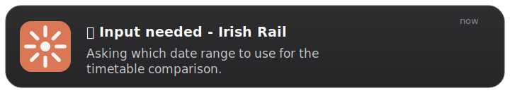
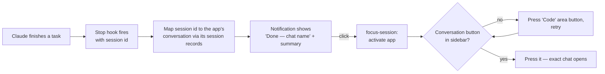

<h1 align="center">Claude Notifications Everywhere</h1>
<p align="center"><i>Notifications from Claude Code wherever you are — terminal, desktop app (Cowork), phone, and (soon) browser.</i></p>

[](https://github.com/silks-road/claude-notifications-everywhere/actions)
[](https://github.com/silks-road/claude-notifications-everywhere/actions)
[](https://github.com/silks-road/claude-notifications-everywhere/actions)

> **🖥️ This fork adds [Claude Desktop app (Cowork) support](#claude-desktop-cowork-support-this-fork)** — notifications from desktop app sessions, conversation names in every alert, and click-to-open-the-exact-conversation. Forked from [777genius/claude-notifications-go](https://github.com/777genius/claude-notifications-go).

<p align="center">
  <br/>
  
</p>

Smart notifications for Claude Code with click-to-focus, git branch display, and webhook integrations.

> **Boost your productivity** — check out the [advanced task manager for Claude with a convenient UI](https://github.com/777genius/claude_agent_teams_ui), from the creator of this plugin.

## Table of Contents

  - [Claude Desktop (Cowork) support — this fork](#claude-desktop-cowork-support-this-fork)
  - [Features](#features)
  - [Installation](#installation)
    - [Prerequisites](#prerequisites)
    - [Quick Install (Recommended)](#quick-install-recommended)
    - [Manual Install](#manual-install)
    - [Updating](#updating)
  - [Supported Notification Types](#supported-notification-types)
  - [Platform Support](#platform-support)
    - [Click-to-Focus (macOS & Linux)](#click-to-focus-macos--linux)
  - [Configuration](#configuration)
    - [Manual Configuration](#manual-configuration)
    - [Sound Options](#sound-options)
    - [Test Sound Playback](#test-sound-playback)
  - [Manual Testing](#manual-testing)
  - [Contributing](#contributing)
  - [Troubleshooting](#troubleshooting)
  - [Documentation](#documentation)
  - [License](#license)

## Claude Desktop (Cowork) support (this fork)

Everything below is on top of the upstream plugin, which only knew about terminals. If you run Claude Code inside the **Claude desktop app** (Cowork "Home" tasks or the "Code" tab), this fork makes notifications first-class there:

- **Desktop app sessions detected automatically** — hooks fired from the app (instead of a terminal) get desktop-appropriate behavior; terminal sessions keep all upstream behavior.
- **The alert tells you *which chat*** — title format `✅ Done — <conversation name>`, resolved live from the app's own session records. Running several Home + Code sessions at once stays legible.
- **One-sentence summaries** — the body is the outcome sentence of Claude's reply (markdown stripped, capped ~110 chars), not a wall of raw text.
- **Click opens the exact conversation** — not just the app. There is no public deep link for this (`claude://resume` *imports a duplicate* of the session — don't use it), so the plugin drives the app's UI through the macOS Accessibility API: activate app → switch Home/Code area if needed → press the conversation's sidebar item. Falls back to plain app activation if anything is missing, and launches the app if it isn't running.

### Setup (macOS) — no terminal or git needed

Everything happens inside Claude Code or the Claude desktop app; the plugin downloads its own pre-built program (from this repo's [Releases](https://github.com/silks-road/claude-notifications-everywhere/releases)) the first time it runs.

1. **Install the plugin** — type these two commands into any Claude chat input, one at a time:
   ```
   /plugin marketplace add silks-road/claude-notifications-everywhere
   ```
   ```
   /plugin install claude-notifications-go@claude-notifications-go
   ```
2. **Grant permissions** (each once):
   - *System Settings → Notifications → Claude Notifier*: **Allow**, style **Alerts** (persistent).
   - *System Settings → Privacy & Security → Accessibility*: enable **ClaudeNotifier** — this is what lets a notification click press the right conversation in the sidebar. Until granted, clicks still focus the app.
   - Using Focus modes? Add both **Claude** and **Claude Notifier** to the allowed apps.

3. *(Optional, for developers)* Building from source instead: clone the repo, `make build`, then copy `bin/claude-notifications` over the cached binary in `~/.claude/plugins/cache/claude-notifications-go/claude-notifications-go/<version>/bin/`.

> **Prefer to delegate?** Paste this into a Claude Code / Cowork chat and let Claude do the whole thing:
> *"Install the claude-notifications-everywhere plugin from github.com/silks-road/claude-notifications-everywhere: add its marketplace, install the plugin, then walk me through the macOS notification and accessibility permissions it needs."*

### How click-to-conversation works



**Known limitations:** macOS only (Apple Silicon tested); navigation visibly "walks" through the UI for a second (it is pressing real buttons — a native `claude://open-session` deep link from Anthropic would remove this); conversations renamed mid-task are still found (records are read at click time), but a conversation missing from the sidebar entirely can't be pressed and falls back to app focus.

---

## Features

- **Cross-platform**: macOS (Intel & Apple Silicon), Linux (x64 & ARM64), Windows 10+ (x64)
- **Claude Desktop app (Cowork) support** *(this fork)*: conversation name in every alert, one-sentence summaries, click opens the exact conversation — [details](#claude-desktop-cowork-support-this-fork)
- **6 notification types**: Task Complete, Review Complete, Question, Plan Ready, Session Limit, API Error
- **Click-to-focus** (macOS, Linux): click notification to focus the exact project window and tab — Ghostty, VS Code, iTerm2, Warp, kitty, WezTerm, Alacritty, Hyper, Apple Terminal, GNOME Terminal, Konsole, Tilix, Terminator, XFCE4 Terminal, MATE Terminal
- **Multiplexers**: tmux (including iTerm2 -CC integration mode), zellij, WezTerm, kitty — click switches to the correct session/pane/tab
- **Git branch in title** (terminal sessions): `✅ Done main [cat]`
- **Sounds**: MP3/WAV/FLAC/OGG/AIFF, volume control, audio device selection
- **Webhooks**: Slack, Discord, Telegram, Lark/Feishu, Microsoft Teams, ntfy.sh, PagerDuty, Zapier, n8n, Make, custom — with retry, circuit breaker, rate limiting ([docs](docs/webhooks/README.md))
- **[Plugin compatibility](docs/PLUGIN_COMPATIBILITY.md)**: works with [double-shot-latte](https://github.com/obra/double-shot-latte) and other plugins that spawn background Claude instances

## Installation

### Prerequisites

- Claude Code
- **Windows users:** Git Bash (included with [Git for Windows](https://git-scm.com/download/win))
- **macOS/Linux users:** No additional software required

### Quick Install (Recommended)

> **Using the Claude desktop app (Cowork)?** The quick installer downloads *upstream* release binaries, which do not include this fork's desktop-app features. Follow [the fork setup](#claude-desktop-cowork-support-this-fork) (build from source) instead.

One command to install everything:

```bash
curl -fsSL https://raw.githubusercontent.com/777genius/claude-notifications-go/main/bin/bootstrap.sh | bash
```

> Windows users: run this from Git Bash. If you run it from PowerShell and `bash` opens WSL, the installer would target Linux paths and binaries instead of Windows.

Then restart Claude Code and optionally run `/claude-notifications-go:settings` to configure sounds.

The binary is downloaded once and cached locally. You can re-run `/claude-notifications-go:settings` anytime to reconfigure.

> If the bootstrap script doesn't work for your environment, use the [Manual Install](#manual-install) steps below inside Claude Code.

### Manual Install

<details>
<summary>Step-by-step installation inside Claude Code (if bootstrap doesn't work)</summary>

Run these slash commands in the Claude Code chat, not in your system terminal:

```text
# 1) Add marketplace
/plugin marketplace add 777genius/claude-notifications-go
# 2) Install plugin
/plugin install claude-notifications-go@claude-notifications-go
# 3) Restart Claude Code
# 4) Download binary
/claude-notifications-go:init
# 5) (Optional) Configure sounds and settings
/claude-notifications-go:settings
```

</details>

> Having issues with installation? See [Troubleshooting](#troubleshooting).

### Updating

Run the same command as for installation — it will update both the plugin and the binary:

```bash
curl -fsSL https://raw.githubusercontent.com/777genius/claude-notifications-go/main/bin/bootstrap.sh | bash
```

Then restart Claude Code to apply the new version. Your settings in `~/.claude/claude-notifications-go/config.json` are preserved across updates.

<details>
<summary>Manual update (if bootstrap didn't work)</summary>

Claude Code also periodically checks for plugin updates automatically. Binaries are updated on the next hook invocation when a version mismatch is detected.

To update manually via Claude Code UI:

1. Run `/plugin`, select **Marketplaces**, choose `claude-notifications-go`, then select **Update marketplace**
2. Select **Installed**, choose `claude-notifications-go`, then select **Update now**

If the binary auto-update didn't work (e.g. no internet at the time), run `/claude-notifications-go:init` to download it manually. If hook definitions changed in the new version, restart Claude Code to apply them.

</details>

## Supported Notification Types

| Status | Icon | Description | Trigger |
|--------|------|-------------|---------|
| Task Complete | ✅ | Main task completed | Stop/SubagentStop hooks (state machine detects active tools like Write/Edit/Bash, or ExitPlanMode followed by tool usage). *This fork:* reclassified as Question when the final message asks the user something ("approval needed", trailing "?") |
| Review Complete | 🔍 | Code review finished | Stop/SubagentStop hooks (state machine detects only read-like tools: Read/Grep/Glob with no active tools, plus long text response >200 chars) |
| Question | ❓ | Claude has a question | PreToolUse hook (AskUserQuestion) OR Notification hook |
| Plan Ready | 📋 | Plan ready for approval | PreToolUse hook (ExitPlanMode) |
| Session Limit Reached | ⏱️ | Session limit reached | Stop/SubagentStop hooks (state machine detects "Session limit reached" text in last 3 assistant messages) |
| API Error | 🔴 | Authentication expired, rate limit, server error, connection error | Stop/SubagentStop hooks (state machine detects via `isApiErrorMessage` flag + `error` field from JSONL) |

## Platform Support

**Supported platforms:**
- macOS (Intel & Apple Silicon)
- Linux (x64 & ARM64)
- Windows 10+ (x64)

**No additional dependencies:**
- ✅ Binaries auto-download from GitHub Releases
- ✅ Pure Go - no C compiler needed
- ✅ All libraries bundled
- ✅ Works offline after first setup

**Windows-specific features:**
- Native Toast notifications (Windows 10+)
- Works in PowerShell, CMD, Git Bash, or WSL
- MP3/WAV/OGG/FLAC audio playback via native Windows APIs
- System sounds not accessible - use built-in MP3s or custom files

### Click-to-Focus (macOS & Linux)

Clicking a notification activates your terminal window. Auto-detects terminal and platform.

**macOS** — via AX API with bundle ID detection:

| Terminal | Focus method |
|----------|-------------|
| Ghostty | Exact tab focus via Ghostty AppleScript, with AXDocument fallback |
| VS Code / Insiders / Cursor | AXTitle (focus-window subcommand) |
| iTerm2 | Exact tab/pane targeting via iTerm2 Python API when available, otherwise app-level iTerm activation |
| Warp, kitty, WezTerm, Alacritty, Hyper, Apple Terminal | AXTitle (focus-window subcommand) |
| Any other (custom `terminalBundleId`) | AXTitle (focus-window subcommand) |

**Linux** — via D-Bus daemon with automatic compositor detection:

| Terminal | Supported compositors |
|----------|----------------------|
| VS Code | GNOME, KDE, Sway, X11 |
| GNOME Terminal, Konsole, Alacritty, kitty, WezTerm, Tilix, Terminator, XFCE4 Terminal, MATE Terminal | GNOME, KDE, Sway, X11 |
| Any other | Fallback by name |

Linux focus methods (tried in order): GNOME extension, GNOME Shell Eval, GNOME FocusApp, wlrctl (Sway/wlroots), kdotool (KDE), xdotool (X11).

**Multiplexers** (both platforms): tmux (including iTerm2 -CC integration mode), zellij, WezTerm, kitty — click switches to the correct pane/tab.

**iTerm2 note:** to open the exact iTerm2 tab or split pane, enable `iTerm2 > Settings > General > Magic > Enable Python API`. If you just toggled it, restart iTerm2 once. Without the Python API, the plugin falls back to app-level iTerm activation instead of exact tab targeting.

**Windows** — clicking a notification raises the originating terminal **window** (Windows Terminal, VS Code, conhost, …) via a protocol-activated toast. Window-level only: tab/split-pane targeting isn't possible (one window hosts all tabs), and picking among multiple WT windows in one process is best-effort. See the guide for details.

See **[Click-to-Focus Guide](docs/CLICK_TO_FOCUS.md)** for configuration details.

## Configuration

Run `/claude-notifications-go:settings` to configure sounds, volume, webhooks, and other options via an interactive wizard. You can re-run it anytime to reconfigure.

### Manual Configuration

Config file location:

| Platform | Path |
|----------|------|
| macOS / Linux | `~/.claude/claude-notifications-go/config.json` |
| Windows (Git Bash) | `~/.claude/claude-notifications-go/config.json` |
| Windows (PowerShell) | `$env:USERPROFILE\.claude\claude-notifications-go\config.json` |

Edit the config file directly:

```json
{
  "notifications": {
    "desktop": {
      "enabled": true,
      "sound": true,
      "volume": 1.0,
      "audioDevice": "",
      "clickToFocus": true,
      "terminalBundleId": "",
      "appIcon": "${CLAUDE_PLUGIN_ROOT}/claude_icon.png"
    },
    "webhook": {
      "enabled": false,
      "preset": "slack",
      "url": "",
      "chat_id": "",
      "format": "json",
      "headers": {},
      "payloadFields": {}
    },
    "suppressQuestionAfterTaskCompleteSeconds": 12,
    "suppressQuestionAfterAnyNotificationSeconds": 7,
    "notifyOnSubagentStop": false,
    "suppressForSubagents": true,
    "notifyOnTextResponse": true,
    "respectJudgeMode": true,
    "notifyOnlyWhenUnfocused": false,
    "notifyDelaySeconds": 0,
    "suppressFilters": [
      {
        "name": "Suppress ClaudeProbe completions (remote-control)",
        "status": "task_complete",
        "gitBranch": "",
        "folder": "ClaudeProbe"
      }
    ]
  },
  "statuses": {
    "task_complete": {
      "title": "✅ Done",
      "sound": "${CLAUDE_PLUGIN_ROOT}/sounds/task-complete.mp3"
    },
    "review_complete": {
      "title": "🔍 Review",
      "sound": "${CLAUDE_PLUGIN_ROOT}/sounds/review-complete.mp3"
    },
    "question": {
      "title": "❓ Question",
      "sound": "${CLAUDE_PLUGIN_ROOT}/sounds/question.mp3"
    },
    "plan_ready": {
      "title": "📋 Plan",
      "sound": "${CLAUDE_PLUGIN_ROOT}/sounds/plan-ready.mp3"
    },
    "session_limit_reached": {
      "title": "⏱️ Session Limit Reached",
      "sound": "${CLAUDE_PLUGIN_ROOT}/sounds/error.mp3"
    },
    "api_error": {
      "title": "🔴 API Error: 401",
      "sound": "${CLAUDE_PLUGIN_ROOT}/sounds/error.mp3"
    },
    "api_error_overloaded": {
      "title": "🔴 API Error",
      "sound": "${CLAUDE_PLUGIN_ROOT}/sounds/error.mp3"
    }
  }
}
```

| Option | Default | Description |
|--------|---------|-------------|
| `notifyOnSubagentStop` | `false` | Send notifications when subagents (Task tool) complete. Has no effect unless `suppressForSubagents` is also set to `false`. |
| `suppressForSubagents` | `true` | Suppress subagent (`SubagentStop`) notifications, plus any `Stop` notification whose transcript is a subagent/teammate transcript. Detection uses the hook event for `SubagentStop` (Claude Code passes the parent session `transcript_path` to that hook, so a path check alone can't identify it). Set to `false` together with `notifyOnSubagentStop: true` to get a notification each time a subagent finishes. |
| `notifyOnTextResponse` | `true` | Send notifications for text-only responses (no tool usage) |
| `respectJudgeMode` | `true` | Honor `CLAUDE_HOOK_JUDGE_MODE=true` env var to suppress notifications |
| `notifyOnlyWhenUnfocused` | `false` | Skip the desktop notification only when the focused terminal window can be matched to the current Claude Code session. Best-effort per platform; if focus can't be determined the notification is still shown. |
| `notifyDelaySeconds` | `0` | Wait N seconds before delivering a desktop notification (capped at 25s by the hook timeout). With `notifyOnlyWhenUnfocused`, focus is re-checked after the wait. Webhooks are unaffected. |
| `suppressQuestionAfterTaskCompleteSeconds` | `12` | Suppress question notifications for N seconds after task complete |
| `suppressQuestionAfterAnyNotificationSeconds` | `7` | Suppress question notifications for N seconds after any notification |
| `suppressFilters` | `[]` | Array of rules to suppress notifications by status, git branch, and/or folder. Each rule is an AND of its fields; omitted fields match any value. Set `gitBranch` to `""` to match sessions outside git repos. |

Each status can be individually disabled by adding `"enabled": false`.

You can also override individual channels per status:

```json
{
  "statuses": {
    "question": {
      "title": "❓ Question",
      "sound": "${CLAUDE_PLUGIN_ROOT}/sounds/question.mp3",
      "desktop": { "enabled": true },
      "webhook": { "enabled": false }
    }
  }
}
```

`statuses.<name>.enabled` is still the master switch for both channels. Use
`desktop.enabled` and `webhook.enabled` when you want one channel on and the
other off for the same status.

### Focus-Aware & Delayed Notifications

Two independent options cut notification noise when you're already watching the terminal:

- **`notifyOnlyWhenUnfocused`** - skip the desktop notification only when the focused terminal window can be matched to the current Claude Code session.
- **`notifyDelaySeconds`** - wait N seconds before delivering, so a quick task can finish before any banner appears (capped at 25s to stay within the hook timeout).

They compose: with both set, the plugin waits, then notifies only if the terminal still isn't focused - "tell me once I've looked away."

```json
{
  "notifications": {
    "notifyOnlyWhenUnfocused": true,
    "notifyDelaySeconds": 10
  }
}
```

Both apply to **desktop notifications only** - webhook delivery is never delayed or suppressed. Focus detection is best-effort and degrades safely by notifying when unsure:

- macOS: Ghostty can be matched by exact terminal/session metadata; other terminal apps require the frontmost window title to match the project folder and existing Screen Recording access.
- Linux: X11 sessions compare `$WINDOWID` to the active window. Wayland or terminals without `$WINDOWID` are treated as unknown.
- Windows: the foreground window must belong to the hook process ancestry and its title must contain the project folder. Ambiguous multi-window or multi-tab terminal hosts are treated as unknown.

Unknown means "show the notification", not "suppress it".

### Sound Options

**Built-in sounds** (included):
- `${CLAUDE_PLUGIN_ROOT}/sounds/task-complete.mp3`
- `${CLAUDE_PLUGIN_ROOT}/sounds/review-complete.mp3`
- `${CLAUDE_PLUGIN_ROOT}/sounds/question.mp3`
- `${CLAUDE_PLUGIN_ROOT}/sounds/plan-ready.mp3`
- `${CLAUDE_PLUGIN_ROOT}/sounds/error.mp3`

**System sounds:**
- macOS: `/System/Library/Sounds/Glass.aiff`, `/System/Library/Sounds/Hero.aiff`, etc.
- Linux: `/usr/share/sounds/**/*.ogg` (varies by distribution)
- Windows: Use built-in MP3s (system sounds not easily accessible)

**Supported formats:** MP3, WAV, FLAC, OGG/Vorbis, AIFF

### List Available Sounds

See all available notification sounds on your system:

```bash
# List all sounds (built-in + system)
bin/list-sounds

# Output as JSON
bin/list-sounds --json

# Preview a sound
bin/list-sounds --play task-complete

# Preview at specific volume
bin/list-sounds --play Glass --volume 0.5
```

Or use the skill command: `/claude-notifications-go:sounds`

### Audio Device Selection

Route notification sounds to a specific audio output device instead of the system default:

```bash
# List available audio devices
bin/list-devices

# Output:
#   0: MacBook Pro-Lautsprecher
#   1: Babyface (23314790) (default)
#   2: Immersed
```

Then add the device name to your `~/.claude/claude-notifications-go/config.json`:

```json
{
  "notifications": {
    "desktop": {
      "audioDevice": "MacBook Pro-Lautsprecher"
    }
  }
}
```

Leave `audioDevice` empty or omit it to use the system default device.

### Test Sound Playback

Preview any sound file with optional volume control:

```bash
# Test built-in sound (full volume)
bin/sound-preview sounds/task-complete.mp3

# Test with reduced volume (30% - recommended for testing)
bin/sound-preview --volume 0.3 sounds/task-complete.mp3

# Test macOS system sound at 30% volume
bin/sound-preview --volume 0.3 /System/Library/Sounds/Glass.aiff

# Test custom sound at 50% volume
bin/sound-preview --volume 0.5 /path/to/your/sound.wav

# Show all options
bin/sound-preview --help
```

**Volume flag:** Use `--volume` to control playback volume (0.0 to 1.0). Default is 1.0 (full volume).


## Manual Testing

The plugin is invoked automatically by Claude Code hooks. To test manually:

```bash
# Test PreToolUse hook
echo '{"session_id":"test","transcript_path":"/path/to/transcript.jsonl","tool_name":"ExitPlanMode"}' | \
  claude-notifications handle-hook PreToolUse

# Test Stop hook
echo '{"session_id":"test","transcript_path":"/path/to/transcript.jsonl"}' | \
  claude-notifications handle-hook Stop
```

## Contributing

See **[CONTRIBUTING.md](CONTRIBUTING.md)** for development setup, testing, building, and submitting changes.
For local plugin workflows and real-`claude` smoke/manual E2E testing, see **[docs/LOCAL_DEVELOPMENT.md](docs/LOCAL_DEVELOPMENT.md)**.

## Troubleshooting

See **[Troubleshooting Guide](docs/troubleshooting.md)** for common issues:

- **Ubuntu 24.04**: `EXDEV: cross-device link not permitted` during `/plugin install` (TMPDIR workaround)
- **Windows**: install issues related to `%TEMP%` / `%TMP%` location
- **Windows / Git Bash**: GitHub Releases download fails because of proxy / TLS inspection / certificate revocation

## Documentation

- **[Architecture](docs/ARCHITECTURE.md)** - Plugin architecture, directory structure, data flow

- **[Local Development And E2E](docs/LOCAL_DEVELOPMENT.md)** - Local marketplace testing, real Claude smoke tests, manual click-to-focus validation

- **[Click-to-Focus](docs/CLICK_TO_FOCUS.md)** - Configuration, supported terminals, platform details

- **[Volume Control Guide](docs/volume-control.md)** - Customize notification volume
  - Configure volume from 0% to 100%
  - Logarithmic scaling for natural sound
  - Per-environment recommendations

- **[Interactive Sound Preview](docs/interactive-sound-preview.md)** - Preview sounds during setup
  - Interactive sound selection
  - Preview before choosing

- **[Plugin Compatibility](docs/PLUGIN_COMPATIBILITY.md)** - Integration with other Claude Code plugins

- **[Troubleshooting](docs/troubleshooting.md)** - Common install/runtime issues
  - Ubuntu 24.04 `EXDEV` during `/plugin install` (TMPDIR workaround)

- **[Webhook Integration Guide](docs/webhooks/README.md)** - Complete guide for webhook setup
  - **[Slack](docs/webhooks/slack.md)** - Slack integration with color-coded attachments
  - **[Discord](docs/webhooks/discord.md)** - Discord integration with rich embeds
  - **[Telegram](docs/webhooks/telegram.md)** - Telegram bot integration
  - **[Lark/Feishu](docs/webhooks/lark.md)** - Lark/Feishu integration with interactive cards
  - **[Custom Webhooks](docs/webhooks/custom.md)** - Any webhook-compatible service
  - **[Configuration](docs/webhooks/configuration.md)** - Retry, circuit breaker, rate limiting
  - **[Monitoring](docs/webhooks/monitoring.md)** - Metrics and debugging
  - **[Troubleshooting](docs/webhooks/troubleshooting.md)** - Common issues and solutions

## License

GPL-3.0 - See [LICENSE](LICENSE) file for details.
